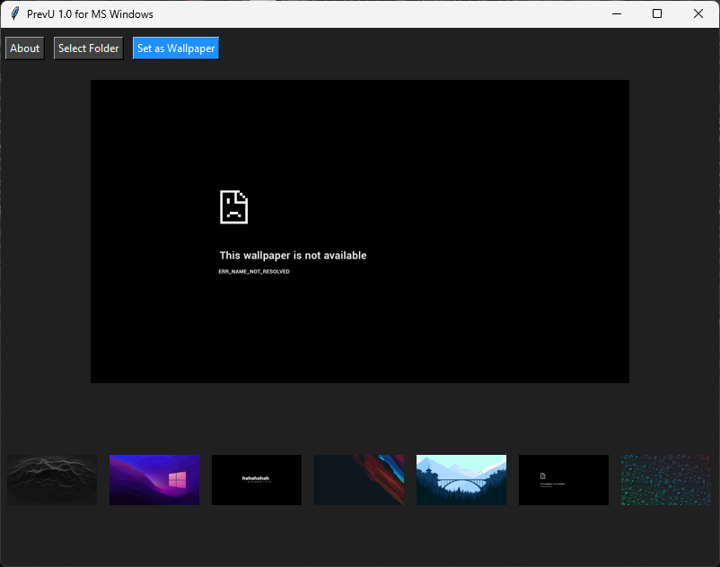

# PrevU

A simple wallpaper browser for Microsoft Windows, written in Python.

## Usage
With PrevU you can preview and set wallpapers from a folder of your choice. Simple as that. Better than the default Windows personalisation menu. It's built with [PyInstaller](https://pyinstaller.org/en/stable/), so python installation is not required.

## Build
If you need to build it from source([main_win.py](main_win.py)) You'll need the following:
### Depedencies:
Install the following depedencies using pip:
- Python 3.12
- Tkinter
- Pillow 12.0.0
The windows executable was built with PyInstaller.

## Changelog
- 1.1: Fix https://github.com/mikeph52/PrevU/issues/2
- 1.0: First release.
